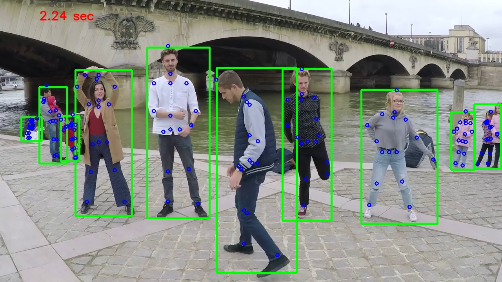
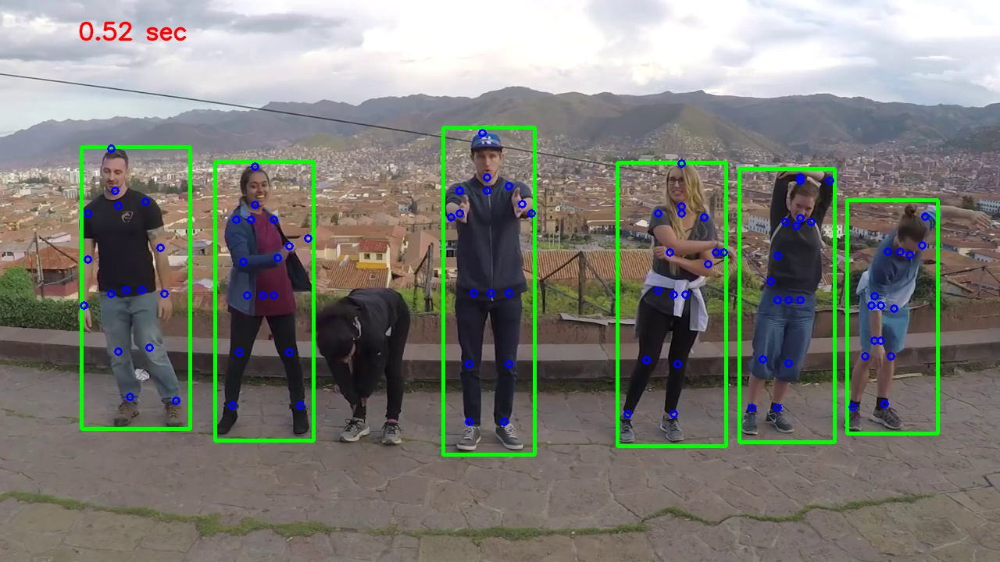

# Improved Convolutional Pose Machines

Pytorch implementation of [*Improved Convolutional Pose Machines for Human Pose Estimation Using Image Sensor Data*](https://www.ncbi.nlm.nih.gov/pmc/articles/PMC6386920/).  
Instead of regular convolutions, depth-wise separable convolutions are used.

### Results on MPII val

| Arch                      | Head | Shoulder | Elbow | Wrist | Hip | Knee | Ankle | Mean | Mean@0.1 |
|---------------------------|------|----------|-------|-------|------|------|-------|------|----------|
| improved-pose-machines    | 95.703 | 92.035 | 83.211 | 77.336 | 83.434 | 75.155 | 69.343 | **83.172** | 27.335 |

Total Parameters: 2,960,630\
Total Multiply Adds (For Convolution and Linear Layers only): 4.8 GFLOPs

### Installation
1. Install pytorch >= v1.0.0 following [official instruction](https://pytorch.org/).
2. Install dependencies:
   ```
   pip install -r requirements.txt
   ```

### [Data preparation](https://github.com/leoxiaobin/deep-high-resolution-net.pytorch#data-preparation)

### Model download ([GoogleDrive](https://drive.google.com/drive/folders/1RcA-Pdv0oalQqTVf5mTNWYsEhEcDo32s?usp=sharing))

### Testing on MPII dataset
```
python tools/test.py \
    --cfg conf.yaml \
    TEST.MODEL_FILE models/improved_pose_machines.pth
```

### Training on MPII dataset
```
python tools/train.py \
    --cfg conf.yaml
```

### Run inference
```
python tools/inference.py --cfg conf.yaml \
    --videoFile demo/video.mp4 \
    --writeBoxFrames \
    --outputDir demo \
    TEST.MODEL_FILE models/improved_pose_machines.pth
```
### Some output:



### Thanks to
- https://github.com/leoxiaobin/deep-high-resolution-net.pytorch#data-preparation
- https://github.com/HowieMa/CPM_Pytorch
